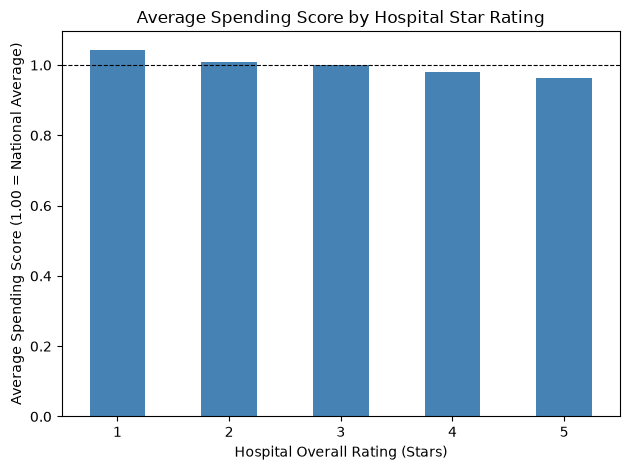
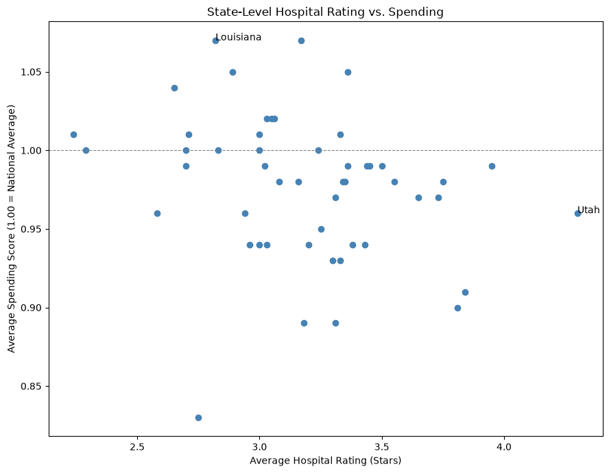

# Hospital Quality vs. Spending

## Project Overview

A data analytics project joining two real CMS (Medicare) datasets covering 5,400+ U.S. hospitals, investigating a real, actively-debated healthcare question: does a hospital spending more per patient actually mean it delivers better quality care? The project combines Python data cleaning, relational join logic, and an interactive Power BI dashboard into one end-to-end analysis.

## Business Problem

**Business context:** I built this project around a realistic (but self-constructed) scenario: a Director of Operations asking me to "look at our healthcare data and show what's going on" — deliberately vague, the kind of open-ended request a junior analyst might actually receive. Working through what was actually being asked led to a specific, real, and genuinely debated healthcare question. The business need itself is a real one health systems and policymakers actively discuss (often called "value-based care"); the specific framing is one I constructed myself to practice answering it.

**Imagined stakeholder:** Director of Operations (a scenario I created to frame the analysis around a real business need)

**Question asked:** Does a hospital spending more per patient actually mean it delivers better quality care — or not?

**Why it matters:** Healthcare spending decisions are high-stakes and expensive. If higher spending doesn't reliably predict better outcomes, that's directly useful information for hospital systems, insurers, and policymakers trying to improve care without just spending more money.

## Dataset

- **Source:** CMS (U.S. Centers for Medicare & Medicaid Services) — the federal agency behind Medicare, via their public [Provider Data Catalog](https://data.cms.gov/provider-data/)
  - [Hospital General Information](https://data.cms.gov/provider-data/dataset/xubh-q36u) — every Medicare-registered hospital, including its overall quality star rating (1–5)
  - [Medicare Spending Per Beneficiary – Hospital](https://data.cms.gov/provider-data/dataset/rrqw-56er) — how much each hospital spends per patient episode, relative to the national median
- **Why aggregated, not patient-level:** individual patient healthcare records are legally protected under HIPAA. CMS publishes this data aggregated at the hospital level, which is both legal and exactly what's needed for this question.
- **Coverage:** 5,419 hospitals (quality) and 4,626 hospitals (spending), both current as of the most recent CMS release (July 2026), covering the most recent reporting period available (spending data reflects calendar year 2024, which is normal — CMS quality data has a real reporting lag due to claims processing time).
- **Size after cleaning:** 2,599 hospitals with both a real quality rating and a real spending score.
- **Limitations:**
  - Only about 48% of all hospitals (2,599 of 5,419) have both a usable rating and a usable spending score — many hospitals are excluded from CMS's rating or spending measures due to insufficient case volume.
  - This is descriptive, not causal — a correlation between spending and quality doesn't prove one causes the other.

## Repository Structure

```
project-05-healthcare-hospital-quality/
├── data/                                raw CMS CSVs and the cleaned, joined export used by Power BI
├── notebooks/                           hospital_quality_vs_spending.ipynb — full narrated analysis
├── images/                              exported chart images (used in this README)
├── HospitalQualityVsSpending.pbix       the Power BI dashboard file
└── README.md
```

## How to Run This Project

A full walkthrough from scratch, assuming nothing is installed yet.

**1. Install VS Code.** Download it free from [code.visualstudio.com](https://code.visualstudio.com/) and run the installer.

**2. Install Python.** Download the latest version from [python.org/downloads](https://www.python.org/downloads/). During installation, check the box that says **"Add Python to PATH."**

**3. Install two VS Code extensions.** Open VS Code, click the Extensions icon in the left sidebar (or press `Ctrl+Shift+X`), and install:
   - **Python** (by Microsoft)
   - **Jupyter** (by Microsoft)

**4. Download this project.** Either:
   - Go to [github.com/Shafinzz/hospital-quality-vs-spending](https://github.com/Shafinzz/hospital-quality-vs-spending), click the green **"Code"** button → **"Download ZIP"** → unzip it somewhere on your computer, or
   - If you have Git installed: `git clone https://github.com/Shafinzz/hospital-quality-vs-spending.git`

**5. Open the project folder in VS Code.** File → Open Folder → select the unzipped/cloned `project-05-healthcare-hospital-quality` folder.

**6. Open a terminal inside VS Code.** Terminal menu → New Terminal.

**7. Install the required Python packages.** In that terminal, run:
```
pip install -r requirements.txt
```

**8. Open the notebook.** In VS Code's file explorer (left sidebar), open `notebooks/hospital_quality_vs_spending.ipynb`.

**9. Select a Python kernel.** The first time you run a cell, VS Code will ask which Python environment to use — pick the one you just installed Python packages into (the one from step 7).

**10. Run the notebook.** Click **"Run All"** at the top of the notebook, or run each cell individually from top to bottom with `Shift+Enter`.

**11. View the dashboard (optional).** Install [Power BI Desktop](https://www.microsoft.com/en-us/power-platform/products/power-bi/desktop) (free, Windows only), then open `HospitalQualityVsSpending.pbix` directly from the project folder.

## Methodology

1. **Cleaning two real, messy government files.** Both datasets had a critical, disguised data-quality issue: missing values were stored as the literal text `"Not Available"` instead of a true blank — completely invisible to a basic `.isnull()` check, only caught by inspecting the actual distinct values in each column. This affected 41% of hospitals in the quality file and 38% in the spending file.
2. **Catching a serious ID-formatting bug before it could break everything.** CMS Facility IDs are zero-padded by state code (e.g., `010001` for an Alabama hospital). When loaded normally, pandas silently guessed one file's ID column was a number (stripping the leading zero) while guessing the other file's was text — meaning most hospitals, especially in low-numbered states, would have silently failed to match in a join. Fixed by explicitly forcing the ID column to load as text in both files.
3. **Choosing INNER JOIN deliberately, not by habit.** A LEFT JOIN keeps every row from the main table even when the other side is missing — the right call when an incomplete row is still useful on its own. This project is different: answering "does spending relate to quality" for a hospital needs *both* a rating and a spending score at once, so an INNER JOIN, keeping only hospitals present in both datasets, is the correct choice here.
4. **Verifying the finding two independent ways.** The correlation was calculated once at the individual-hospital level and once at the state-average level — both landed on nearly the same number, confirming the pattern isn't an artifact of how the data was aggregated.
5. **Rebuilding the analysis in Power BI**, including a DAX Quick Measure for the correlation coefficient — cross-checked against the Python result as a second independent verification.

## Key Findings

- **Higher-rated hospitals spend less per patient, not more.** Correlation of **-0.228** at the hospital level (2,599 hospitals) and **-0.234** at the state level — a weak-to-moderate but real and consistent relationship, not a coincidence.
- Average spending steadily declines from 1-star hospitals (**+4.4% above the national average**) down to 5-star hospitals (**-3.7% below average**).
- **Utah stands out as a genuine "high quality, low cost" state** — the highest average hospital rating of any state (4.30 of 5) while spending slightly *below* the national average. Wisconsin and Minnesota show the same pattern.
- **Louisiana and New Jersey sit at the opposite end** — spending well above average (~1.07) while only achieving middling quality ratings.
- The relationship is real but not dominant — a -0.23 correlation means many other factors clearly influence spending beyond quality alone.

### Dashboard





## Business Recommendations

- **Don't assume higher spending buys better care.** This data shows the opposite pattern, on average — worth challenging that assumption directly in any budget conversation.
- **Study what Utah, Wisconsin, and Minnesota are doing differently** — these states prove that high quality and below-average spending aren't mutually exclusive, making them worth investigating as models.
- **Flag Louisiana and New Jersey for a closer look** — high spending without a corresponding quality payoff is exactly the pattern worth investigating for root cause.
- **Treat this as a starting point, not a final answer** — the relationship is real but weak, meaning spending is only one piece of a bigger picture.

## Tools Used

- Python (pandas, matplotlib)
- Power BI Desktop (Power Query, DAX Quick Measures, scatter charts, slicers)
- CMS Provider Data Catalog (data source)

## Limitations

- Correlation, not causation — this shows a real relationship but doesn't explain *why* it exists.
- Only hospitals with both a usable rating and a usable spending score (48% of all hospitals) are included — the analysis doesn't cover hospitals CMS couldn't rate or measure spending for.
- Spending data reflects 2024, the most recent period CMS had published at time of analysis, not real-time.

## References

- Centers for Medicare & Medicaid Services. [Hospital General Information](https://data.cms.gov/provider-data/dataset/xubh-q36u). CMS Provider Data Catalog. Accessed September 2026.
- Centers for Medicare & Medicaid Services. [Medicare Spending Per Beneficiary – Hospital](https://data.cms.gov/provider-data/dataset/rrqw-56er). CMS Provider Data Catalog. Accessed September 2026.
- Centers for Medicare & Medicaid Services. [Provider Data Catalog](https://data.cms.gov/provider-data/) — home portal for all CMS hospital/provider datasets used in this project.
- U.S. Department of Health & Human Services. [HIPAA (Health Insurance Portability and Accountability Act)](https://www.hhs.gov/hipaa/index.html) — the law that requires healthcare data like this to be published aggregated by hospital, not by individual patient.
- Maslyuk, Daniil. [Correlation coefficient](https://community.powerbi.com/t5/Quick-Measures-Gallery/Correlation-coefficient/m-p/2008108). Power BI Quick Measures Gallery, Microsoft Community. The DAX formula behind this project's Power BI correlation KPI card was generated from this community-contributed Quick Measure template, not written from scratch.

## Future Improvements

- Bring in a third CMS dataset (like the Hospital Readmissions Reduction Program data) to test whether the same pattern holds for a different quality measure, not just the overall star rating.
- Investigate Hospital Type and Ownership as additional factors — do nonprofit vs. for-profit hospitals show a different spending/quality relationship?
- Rebuild the join using actual SQL (SQLite) rather than pandas `.merge()`, for full consistency with the SQL skills built earlier in this portfolio.
- Learn and add the full hand-written DAX Pearson correlation formula, instead of relying on Power BI's Quick Measure template, as a deeper DAX skill-building exercise.
